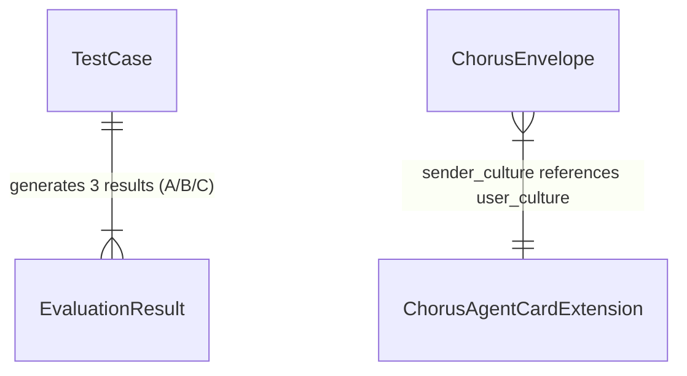

<!-- Author: Lead -->

# Data Models — Chorus Protocol Phase 0

> 本项目无传统数据库。数据模型 = JSON Schema + 文件格式定义。

## 核心实体

### 1. ChorusEnvelope（信封）

运行时对象，嵌入 A2A Message Extension。

| 字段 | 类型 | 约束 | 说明 |
|------|------|------|------|
| chorus_version | string | NOT NULL, "0.1" | 协议版本 |
| original_semantic | string | NOT NULL, min 1 char | 原始语义意图 |
| sender_culture | string | NOT NULL, BCP47 | 发送方文化标识 |
| intent_type | string? | enum 或 null | 可选意图标签 |
| formality | string? | enum 或 null | 可选正式度 |
| emotional_tone | string? | enum 或 null | 可选情感基调 |
| relationship_level | string? | enum 或 null | 可选关系亲疏 |

**并发保护**: 不适用（无状态，每条消息独立）

### 2. ChorusAgentCardExtension（Agent Card 扩展）

静态配置，嵌入 A2A Agent Card。

| 字段 | 类型 | 约束 | 说明 |
|------|------|------|------|
| chorus_version | string | NOT NULL | 协议版本 |
| user_culture | string | NOT NULL, BCP47 | 用户文化背景 |
| supported_languages | string[] | NOT NULL, min 1 item | 支持语言列表 |
| communication_preferences | object? | optional | 沟通偏好 |

**并发保护**: 不适用（静态配置）

### 3. TestCase（测试语料）

存储于 `data/test-corpus.json`，200 条。

| 字段 | 类型 | 约束 | 说明 |
|------|------|------|------|
| id | number | UNIQUE, NOT NULL | 序号 1-200 |
| category | string | "taboo" 或 "slang" | 类别 |
| input_text | string | NOT NULL | 原始输入文本 |
| source_culture | string | BCP47 | 来源文化 |
| target_culture | string | BCP47 | 目标文化 |
| context | string | NOT NULL | 文化背景说明（供 judge 参考） |

```json
{
  "id": 1,
  "category": "taboo",
  "input_text": "你看起来胖了不少啊",
  "source_culture": "zh-CN",
  "target_culture": "ja",
  "context": "在中国文化中常作为关心的表达，在日本文化中评论他人体重属于冒犯"
}
```

### 4. EvaluationResult（评分结果）

验证运行器输出，存储于 `results/report.json`。

| 字段 | 类型 | 约束 | 说明 |
|------|------|------|------|
| case_id | number | FK → TestCase.id | 对应测试语料 |
| group | string | "A" / "B" / "C" | 实验组 |
| output_text | string | NOT NULL | 该组的输出文本 |
| scores.intent | number | 1-5 | 意图保留评分 |
| scores.cultural | number | 1-5 | 文化适当性评分 |
| scores.natural | number | 1-5 | 自然度评分 |

**并发保护**: 不适用（批量写入，无并发场景）

## 实体关系



## 无数据库声明

Phase 0 无持久化需求。所有数据为：
- 测试语料：JSON 文件，随代码提交
- 评分结果：JSON 文件，运行时生成
- 信封对象：运行时内存，不持久化
