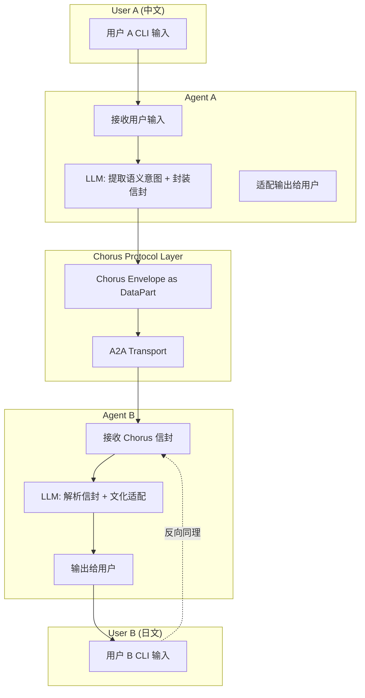
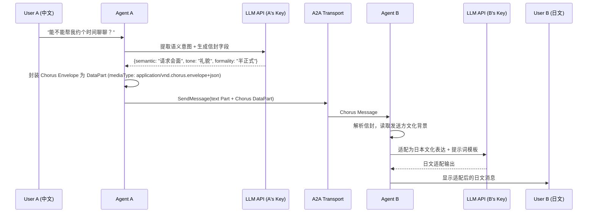
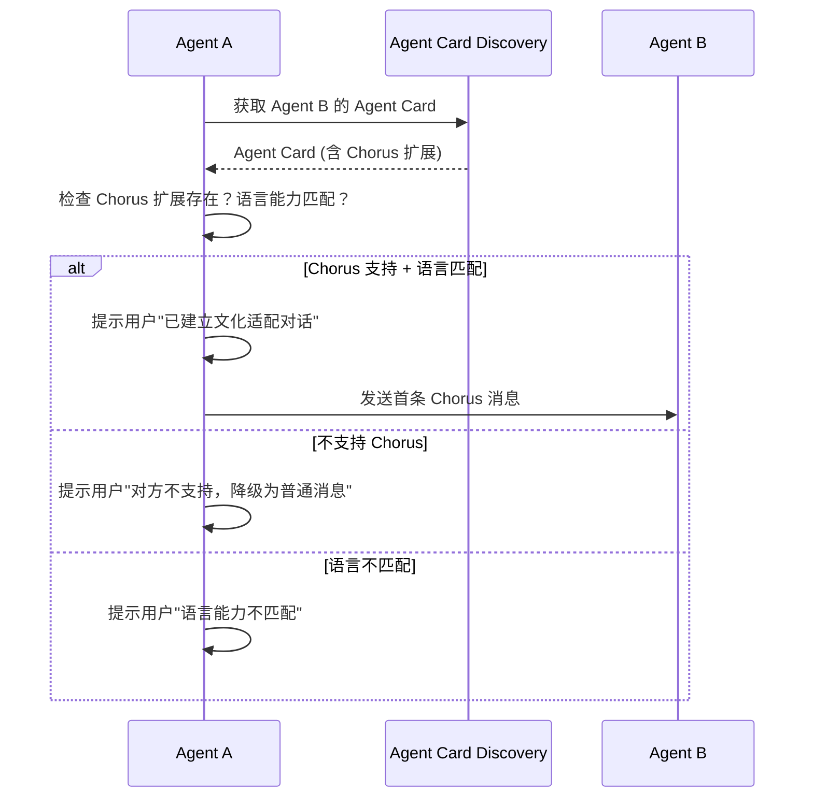
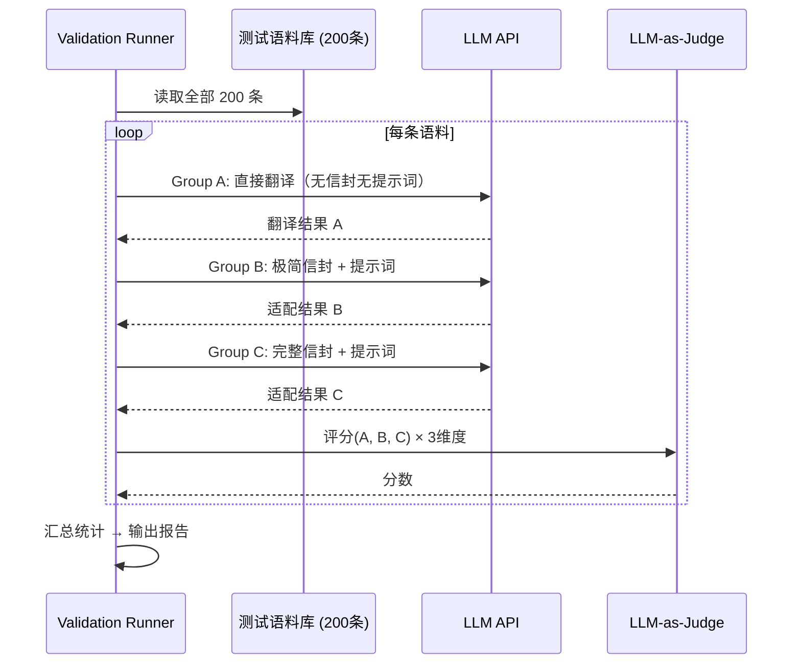

<!-- Author: Lead -->

# System Design — Chorus Protocol Phase 0

## 系统边界

Chorus Phase 0 是一个**协议规范 + 参考实现 + 验证实验**项目，不是传统 Web 应用。

| 组件 | 职责 | 在/不在系统内 |
|------|------|-------------|
| Chorus 协议规范 | JSON Schema + 提示词模板 | ✅ 核心交付 |
| 参考 Agent（TypeScript） | 实现协议的 CLI Agent | ✅ 核心交付 |
| A2A 传输层 | Agent 间通信 | ⚡ 复用 @a2a-js/sdk |
| LLM API | 语义提取 + 文化适配 | 🔌 外部，BYOK |
| 验证运行器 | 200 条语料 × 3 组对比 | ✅ 核心交付 |
| LLM-as-Judge | 三维度评分 | ✅ 核心交付（复用同一 LLM） |
| Astro/Starlight 文档站 | 协议规范的可读渲染 | ⚡ 已有骨架 |

## 组件图



## 关键业务流程

### 流程 1: 单条消息发送（UC-01 核心路径）



### 流程 2: 对话建立（UC-02）



### 流程 3: 三组对比验证（UC-03 / F4）



## 目录结构

```
chorus/
├── spec/                          # 协议规范（核心交付）
│   ├── chorus-envelope.schema.json
│   ├── chorus-agent-card.schema.json
│   └── chorus-prompt-template.md
├── src/                           # 参考实现
│   ├── envelope.ts                # 信封创建/验证
│   ├── agent-card.ts              # Agent Card 扩展创建/验证
│   ├── agent.ts                   # 参考 Chorus Agent
│   ├── runner.ts                  # 验证运行器
│   └── judge.ts                   # LLM-as-Judge 评分
├── data/
│   └── test-corpus.json           # 200 条测试语料
├── docs/                          # Starlight 文档站
├── pipeline/                      # Fusion 流水线
└── package.json
```

## 安全边界标注

| 检查点 | 位置 | 措施 |
|--------|------|------|
| API Key 存储 | Agent 启动时读取环境变量 | 不落盘、不传输、不写入日志 |
| Agent Card 验证 | 对话建立前 | 验证 Chorus 扩展字段符合 Schema |
| 信封格式校验 | 消息接收时 | 验证必填字段存在、版本兼容 |
| HTTPS 传输 | A2A Transport | A2A SDK 默认 HTTPS |
