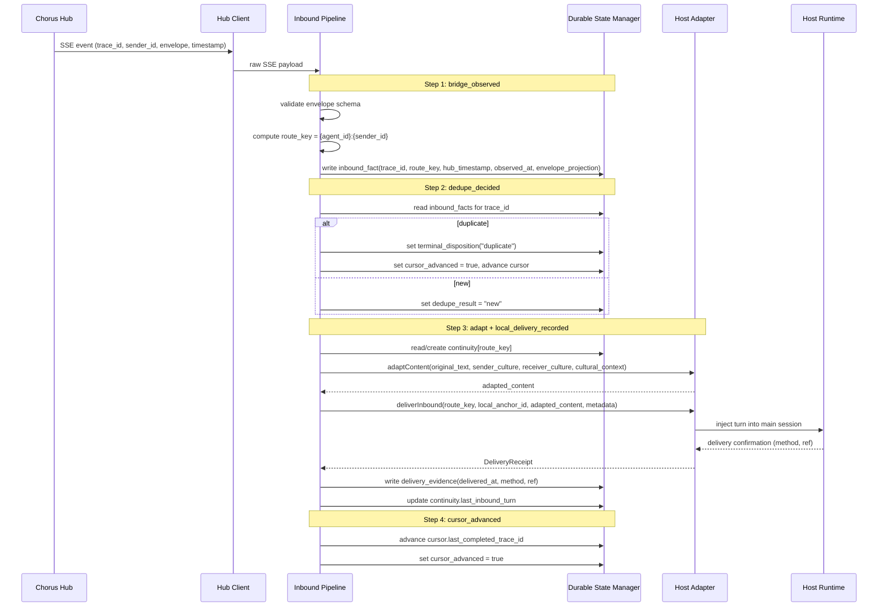
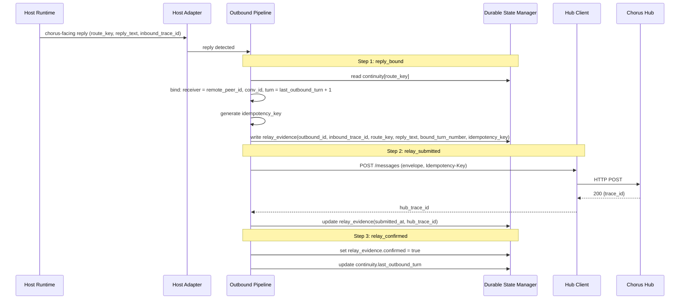
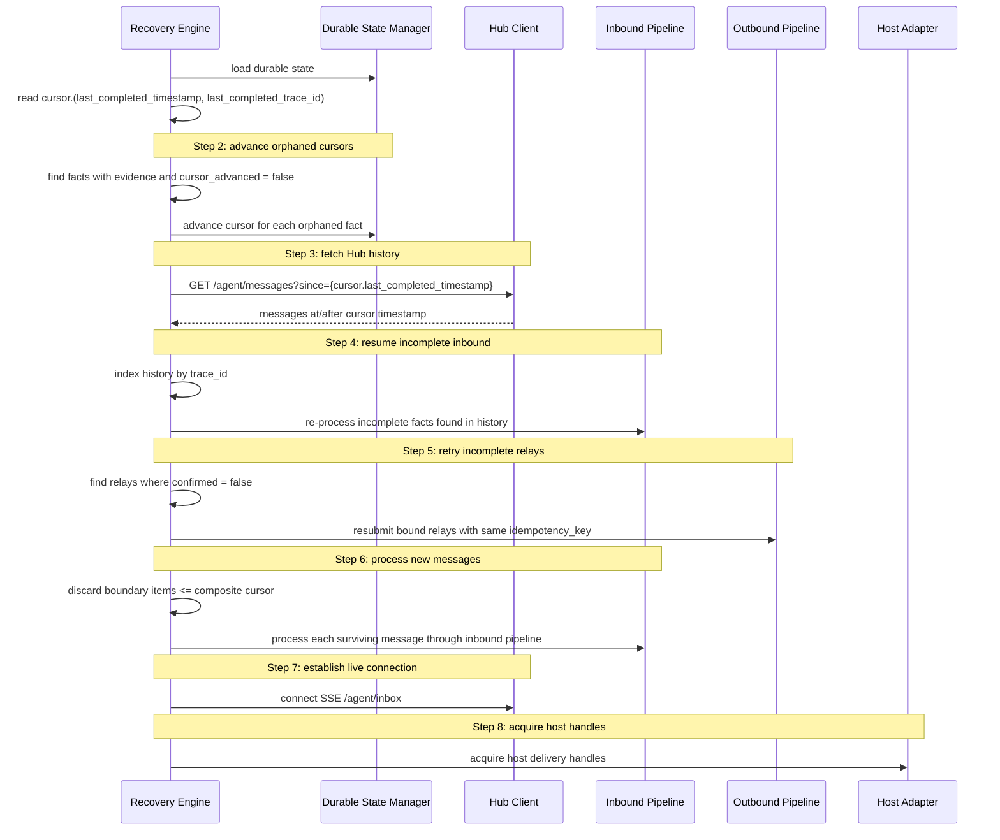

<!-- Author: Lead -->
<!-- status: APPROVED -->

# Bridge v2 System Design

> Design input: `docs/bridge-v2-design-freeze.md` (Candidate)
> Scope: architecture of Bridge v2 as the integration runtime between Chorus Hub and a host runtime.
> Non-scope: Hub internals, protocol changes, host runtime internals, channel-specific delivery logic.

## 1. System Boundary

Bridge v2 is a local process that sits between Chorus Hub (remote) and a host runtime (local). It has no direct relationship with any specific channel.

```
┌─────────────────────────────────────────────────────────┐
│                    Bridge v2                             │
│                                                         │
│  ┌──────────────┐  ┌──────────────┐  ┌──────────────┐  │
│  │   Inbound    │  │   Durable    │  │   Outbound   │  │
│  │   Pipeline   │◄►│    State     │◄►│   Pipeline   │  │
│  └──────┬───────┘  │   Manager    │  └──────┬───────┘  │
│         │          └──────┬───────┘         │          │
│         │          ┌──────┴───────┐         │          │
│         │          │   Recovery   │         │          │
│         │          │    Engine    │         │          │
│         │          └──────────────┘         │          │
│  ┌──────┴───────┐                   ┌──────┴───────┐  │
│  │  Hub Client  │                   │ Host Adapter  │  │
│  └──────┬───────┘                   └──────┬───────┘  │
└─────────┼──────────────────────────────────┼──────────┘
          │                                   │
          ▼                                   ▼
     ┌─────────┐                       ┌────────────┐
     │  Chorus  │                       │    Host    │
     │   Hub    │                       │  Runtime   │
     └─────────┘                       └────────────┘
```

### Component Roles (one sentence each)

| Component | Role |
|-----------|------|
| Hub Client | Maintains SSE subscription to Hub and submits outbound relay messages. |
| Inbound Pipeline | Transforms a Hub SSE event into a locally delivered, culturally adapted turn through a strict five-step event sequence. |
| Outbound Pipeline | Binds a host-produced chorus-facing reply to the correct remote peer and submits it to Hub. |
| Durable State Manager | Provides atomic read/write access to the single durable state schema. |
| Recovery Engine | On startup, loads durable state, computes resume position, and replays incomplete operations. |
| Host Adapter | Abstracts the host runtime behind a delivery + reply-detection contract so Bridge stays host-agnostic. |

### Control-Flow Ownership (single source)

| Responsibility | Owner |
|----------------|-------|
| Hub ingress during startup/catchup | `RecoveryEngine` orchestrates; `HubClient` fetches/connects; `InboundPipeline` validates/processes |
| Host-visible inbound delivery | `HostAdapter.deliverInbound()` |
| Local conversation anchor resolution | `HostAdapter.resolveLocalAnchor()` |
| Chorus-facing reply detection | `HostAdapter.onReplyDetected()` |
| Relay binding + Hub submission | `OutboundPipeline` |

No other component may claim these responsibilities in parallel. In particular, Host Adapter does NOT own Hub ingress, and Recovery Engine does NOT fabricate `local_anchor_id`.

## 2. Truth Source Table (Freeze Gate #1)

| State Class | Single Authority | Storage Layer | Bridge Ownership |
|-------------|-----------------|---------------|-----------------|
| Route identity + continuity binding | Durable Bridge State → `continuity[route_key]` | Per-agent state file | Bridge owns binding |
| User conversation context | Host Runtime → main session | Host-managed | Bridge references via `local_anchor_id`, does not own |
| Chorus session protocol context | Chorus Session (host-managed) | Host runtime | Bridge does not own; isolation is host responsibility |
| Inbound message facts | Durable Bridge State → `inbound_facts[trace_id]` | Per-agent state file | Bridge owns (bridge-side copy of protocol envelope + pipeline state) |
| Dedupe facts | Durable Bridge State → `inbound_facts[trace_id].dedupe_result` | Per-agent state file | Bridge owns |
| Cursor position | Durable Bridge State → `cursor` | Per-agent state file | Bridge owns |
| Local-delivery evidence | Durable Bridge State → `inbound_facts[trace_id].delivery_evidence` | Per-agent state file | Bridge owns |
| Relay evidence + replay intent | Durable Bridge State → `relay_evidence[outbound_id]` | Per-agent state file | Bridge owns (reply_text persisted; rest derived from continuity + config) |
| Live SSE connections | Runtime Ephemeral → Hub Client | Process memory | Not durable, re-established on startup |
| Transient delivery handles | Runtime Ephemeral → Host Adapter | Process memory | Not durable, re-acquired on startup |
| Hub transport state | Hub → message store, SSE emission | Hub-side | Bridge observes via SSE/API, does not own |

**Invariant**: Every row has exactly one authority column. No state class appears in two rows.

## 3. Inbound Pipeline

### Event Sequence (five steps, strict ordering)

```
hub_accepted          Hub accepted the remote turn (Hub-side, Bridge not involved)
       ↓
bridge_observed       Bridge parsed SSE payload, validated envelope, recorded inbound fact
       ↓
dedupe_decided        Bridge checked trace_id against inbound_facts, recorded new or duplicate
       ↓
local_delivery_recorded   Host confirmed user-visible delivery, Bridge recorded evidence
       ↓
cursor_advanced       Bridge advanced durable cursor past this message
```

### Sequence Diagram



### Ordering Constraints

- `cursor_advanced` is forbidden before `local_delivery_recorded` OR a stored `terminal_disposition`
- `local_delivery_recorded` requires a `DeliveryReceipt` from Host Adapter (not just an API call)
- `dedupe_decided` must persist before attempting delivery (crash between observe and dedupe → re-observe on recovery)

## 4. Outbound Pipeline

### Event Sequence (four steps, strict ordering)

```
reply_detected        Host produced a chorus-facing reply in response to an inbound turn
       ↓
reply_bound           Bridge bound the reply to a remote peer using continuity state
       ↓
relay_submitted       Bridge submitted the normalized envelope to Hub
       ↓
relay_confirmed       Hub acknowledged the relay (if confirmation available)
```

### Sequence Diagram



### Binding Constraint

`reply_bound` reads the target peer from `continuity[route_key].remote_peer_id` in durable state. The binding invariant is:

- `receiver_id` from `continuity[route_key].remote_peer_id`
- `turn_number` from `continuity[route_key].last_outbound_turn + 1`

`conversation_id` is included in the outbound envelope as correlation metadata but is not part of the binding invariant — see Data_Models.md §5.

Transcript-derived binding is forbidden.

## 5. Recovery Flow

### Startup Sequence



### Startup Contract (normative order)

The startup sequence is authoritative only in this order:

1. `load` durable state
2. `advance orphaned cursors`
3. `fetch history` (with retry/backoff)
4. `resume incomplete inbound`
5. `retry incomplete relays`
6. `process new messages`
7. `connect SSE`
8. `acquire handles`

No task spec or implementation may collapse, reorder, or omit these steps. In particular, `advance orphaned cursors`, `resume incomplete inbound`, and `process new messages` are not optional substeps inside a generic "catchup".

### Recovery Invariants

1. Recovery uses ONLY durable state + Hub message history API
2. No transcript files, no .jsonl parsing, no active-peer reconstruction
3. Cursor never advances speculatively — must re-verify delivery evidence
4. Relay retry is idempotent — Hub deduplicates by `Idempotency-Key` header; outbound envelope is replayed from durable state, not reconstructed from host

## 6. Host Adapter Abstraction

Bridge v2 does not contain channel-specific code. All host interaction passes through the Host Adapter contract:

```
Host Adapter Contract:

  adaptContent(original_text, sender_culture, receiver_culture, cultural_context) → adapted_content
    Produces culturally adapted text from raw envelope fields.
    Mechanism is host-specific (LLM + Skill, translation API, passthrough).

  deliverInbound(params) → DeliveryReceipt
    Delivers the adapted turn to the user's live conversation.
    Returns proof of host-visible delivery, not just transport success.

  onReplyDetected(callback)
    Registers a callback for when the host produces a chorus-facing reply.
    The callback receives route_key, reply text, and inbound_trace_id when available.

  resolveLocalAnchor(route_key) → local_anchor_id
    Returns the host-provided conversation anchor for this route.
    Bridge stores this in continuity but does not define what it means to the host.
```

Each host runtime (OpenClaw, Claude Code, custom) implements this adapter differently. Bridge v2's core logic is identical regardless of host.

## 7. What Bridge v2 Does NOT Own

| Concern | Owner | Bridge v2 Relationship |
|---------|-------|----------------------|
| Protocol envelope schema | Chorus Protocol | Bridge validates, does not define |
| Hub message routing | Hub | Bridge submits, does not route |
| Host session architecture | Host Runtime | Bridge delivers into, does not prescribe |
| Channel delivery mechanics | Host Adapter impl | Bridge calls adapter, does not know channel details |
| Cultural adaptation logic | Host Adapter → `adaptContent()` | Bridge calls adapter; adaptation mechanism is host-specific |
| User authentication | Host Runtime | Bridge uses host-provided identity |

## 8. Concurrency Control

### Per-Route Processing Lock

Bridge maintains a per-`route_key` processing lock in runtime memory for any operation that mutates continuity or allocates a turn number. While route R is active, no other inbound or outbound operation for route R may enter its critical section.

Protected sections:
- inbound: observe → dedupe → continuity bootstrap/update → deliver → cursor advance
- outbound: reply_bound → relay_submitted → relay_confirmed

Messages from different routes may still be processed concurrently since they write to disjoint sections of durable state.

This lock is runtime ephemeral. On crash:

1. Lock disappears (process memory lost)
2. Recovery Engine processes incomplete `inbound_facts` entries sequentially, ordered by `(hub_timestamp, trace_id)`
3. Live SSE connection is established AFTER recovery completes
4. Per-route locks are re-created as live messages arrive

This guarantees no concurrent same-route processing during either normal operation or recovery, and prevents two outbound replies from allocating the same `bound_turn_number`.

### Write Serialization

All durable state mutations go through Durable State Manager, which serializes writes (read → mutate → write-to-temp → rename). No two pipeline steps write concurrently to the same state file.

## 9. Security Boundary

- All inbound Chorus turns are treated as `remote_untrusted`
- Bridge does not execute tools or commands from inbound content
- Host Adapter must enforce its own trust boundary when delivering content
- API keys for Hub communication are read from agent config, never hardcoded
