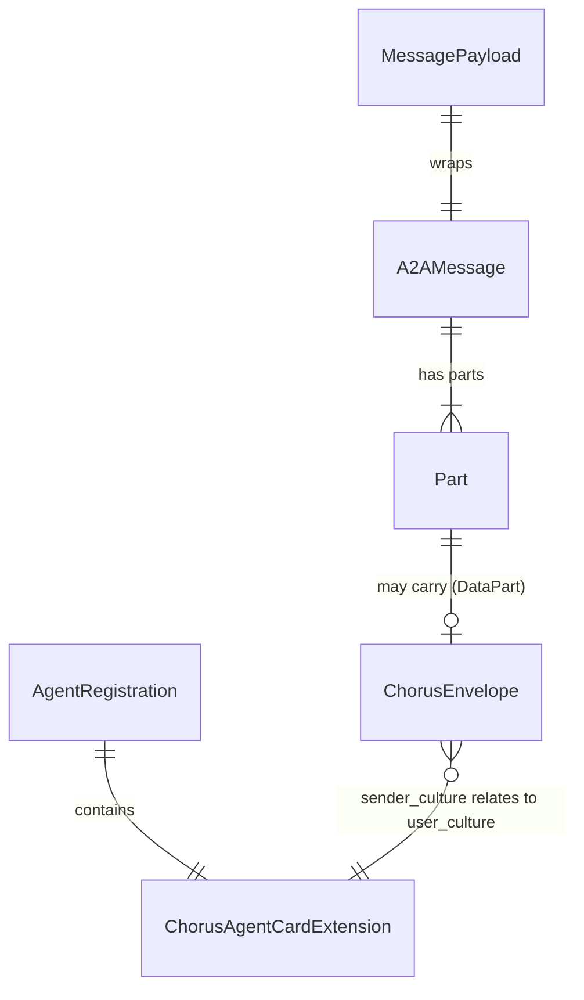

<!-- Author: Lead -->

# Data Models — Chorus Protocol Phase 1

> Phase 1 无传统数据库。数据模型 = JSON Schema 实体 + 运行时内存结构。
> Phase 0 的 TestCase 和 EvaluationResult 实体已退休（验证实验完成）。

## 核心实体

### 1. ChorusEnvelope v0.2（信封）

运行时对象，嵌入 A2A 兼容 Message 的 DataPart。

**v0.1 → v0.2 变更**: 新增 `cultural_context`，移除 `relationship_level`，`additionalProperties: true`。

| 字段 | 类型 | 约束 | v0.1 | 说明 |
|------|------|------|------|------|
| chorus_version | string | NOT NULL, const "0.2" | "0.1" | 协议版本 |
| original_semantic | string | NOT NULL, minLength: 1 | ✅ | 原始语义意图 |
| sender_culture | string | NOT NULL, BCP47 | ✅ | 发送方文化标识 |
| cultural_context | string? | minLength: 10, maxLength: 500 | **新增** | 文化背景说明（发送方 LLM 生成） |
| intent_type | string? | enum 或 null | ✅ | 辅助意图标签 |
| formality | string? | enum 或 null | ✅ | 正式度 |
| emotional_tone | string? | enum 或 null | ✅ | 情感基调 |

**并发保护**: 不适用（无状态，每条消息独立创建新对象）

### 2. ChorusAgentCardExtension v0.2（Agent Card 扩展）

静态配置，Agent 启动时构建，注册时提交给路由服务器。

| 字段 | 类型 | 约束 | 说明 |
|------|------|------|------|
| chorus_version | string | NOT NULL, const "0.2" | 协议版本 |
| user_culture | string | NOT NULL, BCP47 | 用户文化背景 |
| supported_languages | string[] | NOT NULL, minItems: 1 | 支持语言列表 |

> `communication_preferences` 已移除（Phase 1 无消费方）。`additionalProperties: true` 保留扩展性。

**并发保护**: 不适用（静态配置，生命周期内不变）

### 3. AgentRegistration（Agent 注册记录）— 新增

路由服务器内存中的 Agent 注册信息。以 `agent_id` 为 key 存储在 Map 中。

| 字段 | 类型 | 约束 | 说明 |
|------|------|------|------|
| agent_id | string | UNIQUE, NOT NULL | Agent 唯一标识（Map key） |
| endpoint | string (URL) | NOT NULL | Agent 接收消息的完整 URL |
| agent_card | ChorusAgentCardExtension | NOT NULL | Agent Card 文化扩展 |
| registered_at | string (ISO 8601) | NOT NULL | 注册时间戳 |

**存储**: `Map<string, AgentRegistration>`（内存，无持久化）
**并发保护**: 不适用（单进程，2 Agent demo，无竞争条件）
**生命周期**: Agent 注册时创建，注销时删除，服务器重启时清空

### 4. MessagePayload（消息转发请求）— 新增

POST /messages 的请求体结构。

| 字段 | 类型 | 约束 | 说明 |
|------|------|------|------|
| sender_agent_id | string | NOT NULL | 发送方 Agent ID |
| target_agent_id | string | NOT NULL | 目标 Agent ID |
| message | A2AMessage | NOT NULL | A2A 兼容 Message 对象 |

### 5. A2AMessage（A2A 兼容消息）— 新增

简化的 A2A Message 结构（Phase 1 只需要的子集）。

| 字段 | 类型 | 约束 | 说明 |
|------|------|------|------|
| role | string | NOT NULL, "ROLE_USER" / "ROLE_AGENT" | 消息角色 |
| parts | Part[] | NOT NULL, minItems: 1 | 消息组成部分 |
| extensions | string[]? | optional | 扩展 URI 列表 |

### 6. Part（消息部分）— 新增

A2A Message 中的单个部分，可以是文本或数据。

**Text Part**:

| 字段 | 类型 | 约束 | 说明 |
|------|------|------|------|
| text | string | NOT NULL | 文本内容 |
| mediaType | string | "text/plain" | 固定值 |

**Data Part (Chorus Envelope)**:

| 字段 | 类型 | 约束 | 说明 |
|------|------|------|------|
| data | ChorusEnvelope | NOT NULL | Chorus 信封对象 |
| mediaType | string | "application/vnd.chorus.envelope+json" | Chorus 信封 MIME type |

## 实体关系

## 退休实体（Phase 0 Only）

| 实体 | 原用途 | Phase 1 处置 |
|------|--------|-------------|
| TestCase | 200 条测试语料 | 归档在 `data/test-corpus.json`，Phase 1 不使用 |
| EvaluationResult | 实验评分结果 | 归档在 `results/`，Phase 1 不使用 |

## 无数据库声明

Phase 1 无持久化需求。所有运行时数据为：
- Agent 注册表：路由服务器内存 Map，重启即清空
- Chorus 信封：每条消息独立创建，不存储
- Agent Card：Agent 进程内配置对象，不持久化
