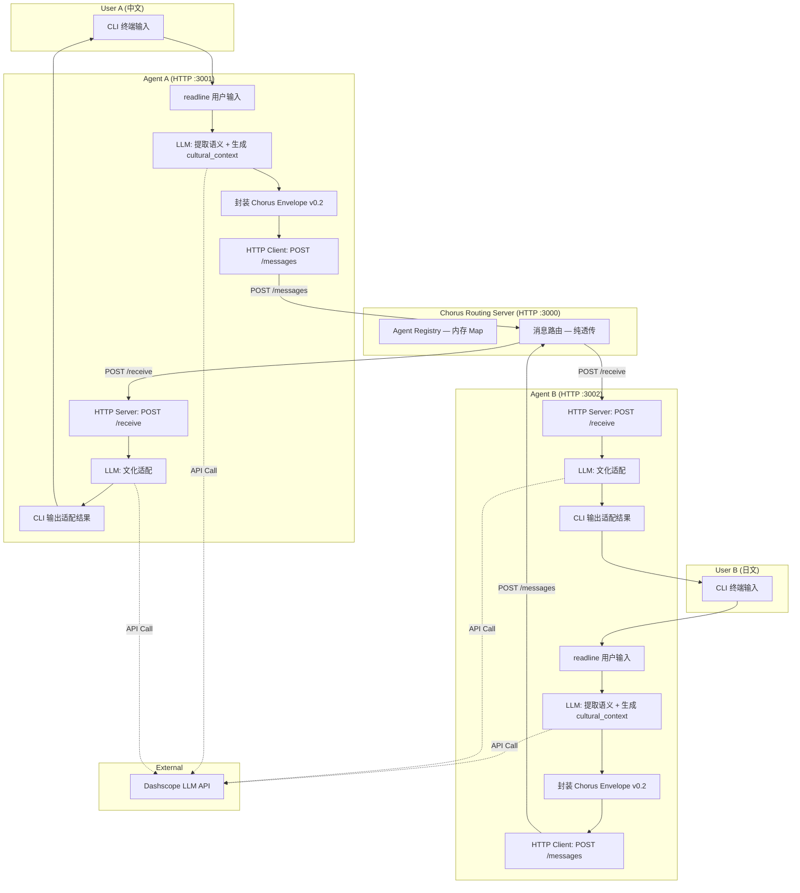
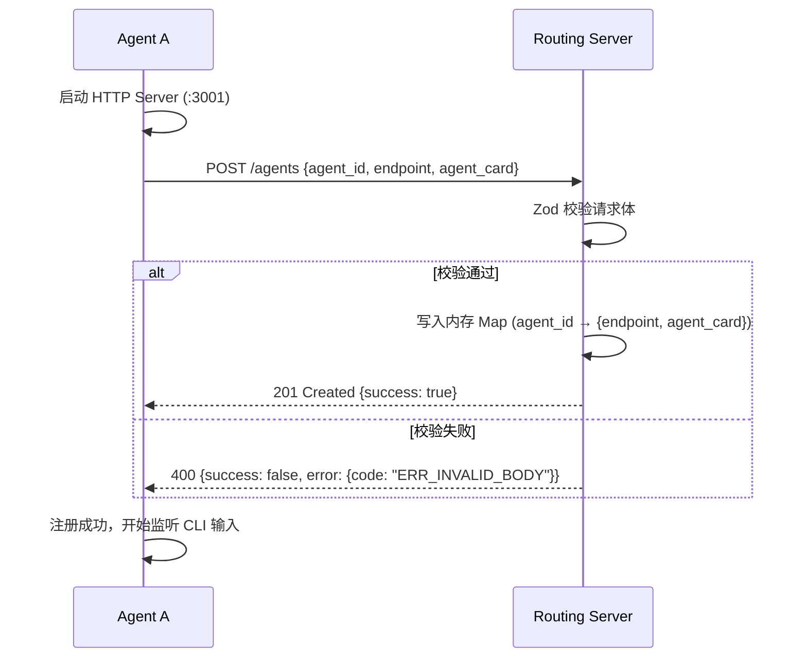
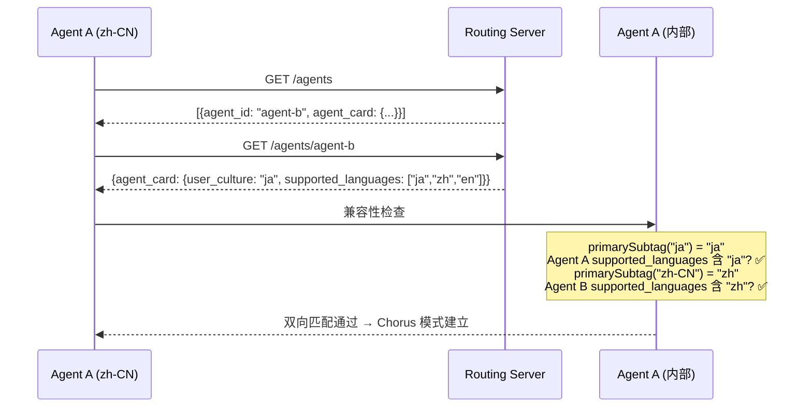
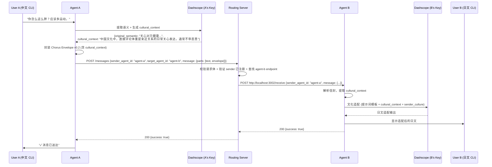
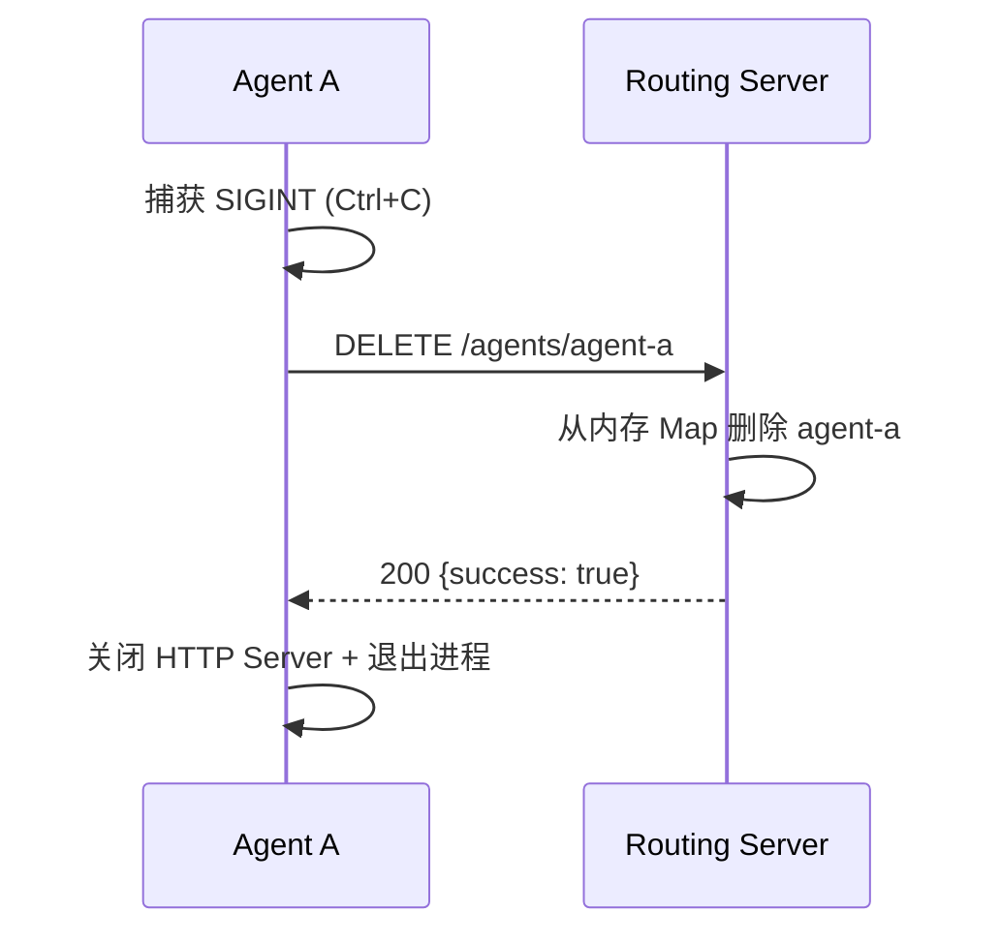

<!-- Author: Lead -->

# System Design — Chorus Protocol Phase 1

## 系统边界

Phase 1 将 Phase 0 的"协议验证"推进为"可运行的端到端系统"。核心变化：新增路由服务器，Agent 从实验脚本升级为可交互的 CLI 程序。

| 组件 | 职责 | Phase 0 → Phase 1 |
|------|------|-------------------|
| Chorus Protocol Spec v0.2 | JSON Schema + 提示词模板 | 更新：新增 `cultural_context` 字段，`additionalProperties: true` |
| Chorus Routing Server | Agent 注册/发现 + 消息透传 | **新增** |
| Reference Agent (zh-CN + ja) | CLI 交互 + LLM 语义提取/文化适配 | 重写：从实验脚本 → 可交互 CLI |
| Dashscope LLM API | 语义提取 + cultural_context 生成 + 文化适配 | 复用（BYOK） |

**不在系统内**:
- 数据库（内存存储，无持久化）
- Web UI（CLI 交互）
- 鉴权系统（内部 demo）
- A2A SDK（使用 A2A 兼容 JSON 格式 + raw HTTP，见 ADR-P1-001）

## 组件图



**组件职责一句话**:
- **Routing Server**: 管理 Agent 注册表 + 按 agent_id 查找 endpoint + 转发 HTTP 请求（不解析/修改信封内容）
- **Reference Agent**: 用户输入 → LLM 语义提取 → 信封封装 → 发送；接收 → 信封解析 → LLM 适配 → 显示。单一二进制，`--culture` 参数区分文化配置（zh-CN / ja 共用代码）
- **Dashscope LLM**: 提供语义理解和文化适配的推理能力（Agent 通过 HTTP API 调用）

## 关键业务流程

### 流程 1: Agent 注册（启动时）



### 流程 2: Agent 发现 + 兼容性检查



### 流程 3: 消息发送（核心路径）



**延迟分解** (PRD: 单跳 < 5s，从信封就绪到对方收到适配输出):
| 阶段 | 耗时 |
|------|------|
| Agent A → Routing Server (HTTP) | ~10ms |
| Routing Server → Agent B (HTTP) | ~10ms |
| Agent B LLM 文化适配 | ~2-4s |
| **总计** | **~2-4s** (≤ 5s) |

> 不含发送方 LLM 提取时间（用户可接受"思考中"等待）。

### 流程 4: Agent 注销（退出时）



## 目录结构（建议）

```
chorus/
├── spec/                           # D1: 协议规范 (v0.2)
│   ├── chorus-envelope.schema.json
│   ├── chorus-agent-card.schema.json
│   └── chorus-prompt-template.md
├── src/
│   ├── server/                     # D2: 路由服务器
│   │   ├── index.ts                # 入口 + HTTP 服务器启动
│   │   ├── registry.ts             # 内存 Agent 注册表
│   │   ├── routes.ts               # HTTP 路由定义
│   │   └── validation.ts           # Zod 请求校验 Schema
│   ├── agent/                      # D3: 参考 Agent
│   │   ├── index.ts                # 入口 + CLI 循环
│   │   ├── envelope.ts             # Chorus 信封创建/解析/校验
│   │   ├── llm.ts                  # Dashscope LLM 客户端
│   │   ├── receiver.ts             # HTTP Server (接收转发消息)
│   │   └── discovery.ts            # Agent 发现 + 兼容性检查
│   └── shared/                     # 共享
│       └── types.ts                # TypeScript 类型定义
├── tests/                          # 测试
├── data/                           # Phase 0 测试语料 (归档)
├── spec/                           # 协议规范
├── pipeline/                       # Fusion 流水线
└── package.json
```

## 安全边界标注

| 检查点 | 位置 | 措施 |
|--------|------|------|
| API Key 存储 | Agent 启动时读取 `DASHSCOPE_API_KEY` 环境变量 | 不落盘、不传输、不写入日志、不嵌入信封 |
| 信封格式校验 | Agent 接收消息时 | Zod 验证必填字段 + cultural_context 长度约束 |
| 路由请求校验 | Routing Server 各端点 | Zod 校验所有入参（agent_id、endpoint URL、message 结构） |
| Agent Card 校验 | Agent 发现时 | 验证 Chorus 扩展字段 + 语言匹配算法 |
| 信封透传不变量 | Routing Server 转发时 | 路由服务器不解析/修改 `message` 对象内容 |
| HTTP 通信 | localhost 内网 | Phase 1 为本地 demo，无需 HTTPS。公网部署时需升级 |
